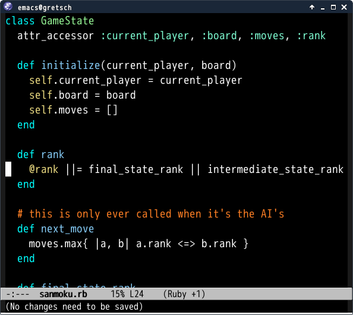

# Reverse theme for Emacs [![melpa badge][melpa-badge]][melpa-link] [![melpa stable badge][melpa-stable-badge]][melpa-stable-link]

Color theme like `emacs -r` or `emacs --reverse-video`

## Requirements

* Emacs 24 or higher

## ScreenShot

## Installation

`reverse-theme` is available on [MELPA](https://melpa.org/) and [MELPA stable](https://stable.melpa.org/)

You can install `reverse-theme` with the following command.

<kbd>M-x package-install [RET] reverse-theme [RET]</kbd>

[melpa-link]: https://melpa.org/#/reverse-theme
[melpa-stable-link]: https://stable.melpa.org/#/reverse-theme
[melpa-badge]: https://melpa.org/packages/reverse-theme-badge.svg
[melpa-stable-badge]: https://stable.melpa.org/packages/reverse-theme-badge.svg
